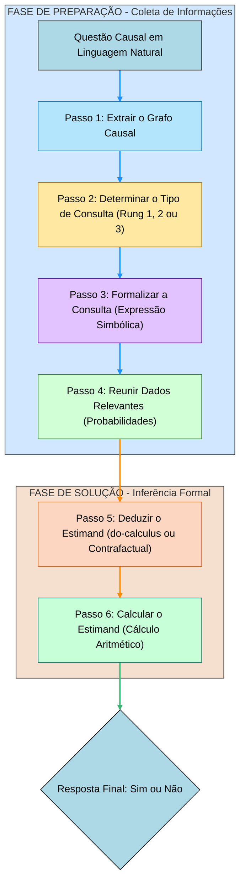

A metodologia central descrita no artigo CLADDER para eliciar o raciocínio causal formal em Large Language Models (LLMs) é a estratégia **CAUSALCOT** (Chain-of-Thought Causal). Esta estratégia de *prompting* é inspirada no conceito do **Motor de Inferência Causal (CI Engine)** postulado por Pearl, que decompõe um problema causal complexo em seis passos sequenciais e fundamentados simbolicamente.

O fluxograma a seguir, criado em Mermaid JS, detalha esses seis passos, divididos nas fases de Preparação e Solução, conforme exigido pelo prompt do CAUSALCOT:

### Explicação do Fluxograma (CAUSALCOT)

O processo CAUSALCOT guia o LLM através de uma sequência lógica de sub-habilidades para garantir que ele aplique o **raciocínio causal formal**, e não apenas o conhecimento de senso comum (causal parrots).

#### Fase de Preparação

Esta fase envolve a compreensão e a transcrição dos elementos da pergunta (formulada em linguagem natural) para uma representação formal:

1.  **Passo 1: Extrair o Grafo Causal**: O modelo identifica e expressa a estrutura de grafo acíclico dirigido (DAG) que representa as relações de causa e efeito no cenário hipotético. Esta etapa avalia a sub-habilidade de **Extração de Relação Causal**.
2.  **Passo 2: Determinar o Tipo de Consulta (Rung)**: O modelo classifica a pergunta de acordo com a Escada de Causalidade de Pearl (Rung 1: Associação, Rung 2: Intervenção, Rung 3: Contrafactual). Esta é uma classificação multi-classe, e a correta identificação do Rung é crucial para a formalização correta. Esta etapa avalia a sub-habilidade de **Classificação de Questão Causal**.
3.  **Passo 3: Formalizar a Consulta**: A consulta, já classificada, é traduzida para sua **forma simbólica precisa** (por exemplo, usando a notação $P(Y|X)$ para Rung 1, $E[Y|do(X)]$ para Rung 2, ou $P(Y_x=y)$ para Rung 3). Esta etapa avalia a sub-habilidade de **Formalização**.
4.  **Passo 4: Reunir Dados Relevantes**: O modelo extrai os valores numéricos de probabilidades marginais ou condicionais fornecidos no prompt. O LLM deve parsear semanticamente os dados para o formato padronizado (e.g., $P(\dots|\dots)=\dots$). Esta etapa avalia a sub-habilidade de **Análise Semântica** (Semantic Parsing).

#### Fase de Solução

Esta fase é onde o raciocínio formal de inferência causal é aplicado:

5.  **Passo 5: Deduzir o Estimand**: Utilizando o grafo causal (Passo 1), o tipo de consulta (Passo 2) e a expressão simbólica (Passo 3), o modelo aplica as regras da inferência causal (como o *do-calculus* para Rung 2 ou previsão contrafactual para Rung 3) para simplificar a expressão formal em um **Estimand** — uma expressão que pode ser calculada com os dados disponíveis (Rung 1). Esta etapa avalia a sub-habilidade de **Inferência Causal Formal**.
6.  **Passo 6: Calcular o Estimand**: O modelo insere os dados numéricos (Passo 4) no *Estimand* deduzido (Passo 5) e realiza os cálculos aritméticos básicos para obter a resposta numérica final. Esta etapa avalia a sub-habilidade de **Aritmética**.

O resultado final do Passo 6 leva à **Resposta Final (Sim/Não)**, que é o objetivo principal do *benchmark* 

### Explicação do Fluxograma (CAUSALCOT)

O processo CAUSALCOT guia o LLM através de uma sequência lógica de sub-habilidades para garantir que ele aplique o **raciocínio causal formal**, e não apenas o conhecimento de senso comum (causal parrots).

#### Fase de Preparação

Esta fase envolve a compreensão e a transcrição dos elementos da pergunta (formulada em linguagem natural) para uma representação formal:

1.  **Passo 1: Extrair o Grafo Causal**: O modelo identifica e expressa a estrutura de grafo acíclico dirigido (DAG) que representa as relações de causa e efeito no cenário hipotético. Esta etapa avalia a sub-habilidade de **Extração de Relação Causal**.
2.  **Passo 2: Determinar o Tipo de Consulta (Rung)**: O modelo classifica a pergunta de acordo com a Escada de Causalidade de Pearl (Rung 1: Associação, Rung 2: Intervenção, Rung 3: Contrafactual). Esta é uma classificação multi-classe, e a correta identificação do Rung é crucial para a formalização correta. Esta etapa avalia a sub-habilidade de **Classificação de Questão Causal**.
3.  **Passo 3: Formalizar a Consulta**: A consulta, já classificada, é traduzida para sua **forma simbólica precisa** (por exemplo, usando a notação $P(Y|X)$ para Rung 1, $E[Y|do(X)]$ para Rung 2, ou $P(Y_x=y)$ para Rung 3). Esta etapa avalia a sub-habilidade de **Formalização**.
4.  **Passo 4: Reunir Dados Relevantes**: O modelo extrai os valores numéricos de probabilidades marginais ou condicionais fornecidos no prompt. O LLM deve parsear semanticamente os dados para o formato padronizado (e.g., $P(\dots|\dots)=\dots$). Esta etapa avalia a sub-habilidade de **Análise Semântica** (Semantic Parsing).

#### Fase de Solução

Esta fase é onde o raciocínio formal de inferência causal é aplicado:

5.  **Passo 5: Deduzir o Estimand**: Utilizando o grafo causal (Passo 1), o tipo de consulta (Passo 2) e a expressão simbólica (Passo 3), o modelo aplica as regras da inferência causal (como o *do-calculus* para Rung 2 ou previsão contrafactual para Rung 3) para simplificar a expressão formal em um **Estimand** — uma expressão que pode ser calculada com os dados disponíveis (Rung 1). Esta etapa avalia a sub-habilidade de **Inferência Causal Formal**.
6.  **Passo 6: Calcular o Estimand**: O modelo insere os dados numéricos (Passo 4) no *Estimand* deduzido (Passo 5) e realiza os cálculos aritméticos básicos para obter a resposta numérica final. Esta etapa avalia a sub-habilidade de **Aritmética**.

O resultado final do Passo 6 leva à **Resposta Final (Sim/Não)**, que é o objetivo principal do *benchmark* CLADDER.
