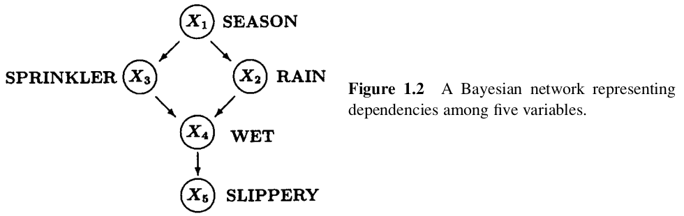

# Mini teste de Turing usando conversação causal
Testes baseados na palestra de Judea Pearl, 2012 ACM A.M. Turing Award Lecture "The Mechanization of Causal Inference" usando GPT-5 Thinking

 

**Figura 1.2** - A Bayesian network representing dependencies among five variables.

## Intro

> Vamos fazer um mini turin teste in conversação causal usando você uma LLM com grande contexto Figure 1.2 illustrates a simple yet typical Bayesian network. It describes relationships among the season of the year (X1), whether rain falls (X2), whether the sprinkler is on (X3), whether the pavement would get wet (X4), and whether the pavement would be slippery (X5). All variables in this figure are binary (taking a value of either true or false) except for the root variable X1, which can take one of four values: spring, summer, fall, or winter. The network was constructed using causal intuition as a guide. The absence of a direct link between X1 and X5, for example, captures our understanding that the influence of seasonal variations on the slipperiness of the pavement is mediated by other conditions (e.g., the wetness of the pavement). This intuition coincides with the independence condition of (1.32), since knowing X4 renders X5 independent of X1, X2, X3. Aguarde o envio das perguntas para este mini teste de Turin.

## Resposta da intro

Perfeito—bora pro mini-Turing causal! pode mandar as perguntas quando quiser. Deixo um “cheat-sheet” do grafo para agilizar minhas respostas:

* **Fatorização do DAG**

    $P(x_1,x_2,x_3,x_4,x_5)=P(x_1),P(x_2\mid x_1),P(x_3\mid x_1),P(x_4\mid x_2,x_3),P(x_5\mid x_4)$.

* **Independências chave (d-separation)**

    $X_5 \perp {X_1,X_2,X_3}\mid X_4$ (dito no enunciado).
    
    $X_2 \not\perp X_3$ (compartilham causa comum $X_1$; mas $X_2 \perp X_3 \mid X_1$.
    
    Condicionar em $X_4$ (colisor de $X_2 \to X_4 \leftarrow X_3$) **abre** dependência: $X_2 \not!\perp X_3 \mid X_4$.

* **Intervenções (truncated factorization)**

    Ex.: $P(x_5\mid \mathrm{do}(x_2)) \propto \sum_{x_1,x_3,x_4} P(x_1)P(x_3\mid x_1)P(x_4\mid x_2,x_3)P(x_5\mid x_4)$.
    
    Ex.: $P(x_5\mid \mathrm{do}(x_4) = \sum_{x_1,x_2,x_3} P(x_1)P(x_2\mid x_1)P(x_3\mid x_1)P(x_5\mid x_4)$ (independe de ($x_2$,$x_3$)).

* **Tipos de pergunta que responderei**

  Observacionais $P(\cdot\mid \cdot)$, intervencionais $P(\cdot\mid \mathrm{do}(\cdot))$ e contrafactuais $(Y_{x} \mid X=x',E=e)$, justificando com d-separation e, se precisar, regras do do-cálculo.

## Q1

**Pergunta:** Se a estação é **seca** e o piso está **escorregadio**, choveu?

## A1

Este é um excelente exemplo de raciocínio diagnóstico e do **viés de colisor** (efeito explicação-eliminação ou explaining away effect), que ocorre quando há condicionamento em um **colisor** ou em seu descendente.

O diagrama causal (Figura 1.2) estabelece as seguintes relações, onde $X_1$ é a Estação, $X_2$ é a Chuva, $X_3$ é o Aspersor, $X_4$ é o Piso Molhado e $X_5$ é o Piso Escorregadio:

1.  **Chuva ($X_2$)** e **Aspersor ($X_3$)** são causas do **Piso Molhado ($X_4$)**.
2.  O **Piso Molhado ($X_4$)** é a causa do **Piso Escorregadio ($X_5$)**.
3.  $X_4$ é um **colisor** no caminho entre $X_2$ e $X_3$ ($X_2 \to X_4 \leftarrow X_3$).
4.  A **Estação ($X_1$)** é uma causa comum de $X_2$ e $X_3$ ($X_2 \leftarrow X_1 \to X_3$).

A análise se baseia nos seguintes pontos da estrutura:

1.  **Cadeia de Dependência:** O piso escorregadio ($X_5=1$) é causado pelo piso molhado ($X_4=0$).
2.  **Colisor Ativado:** O nó **Piso Molhado** ($X_4=0$) é um **colisor** (ou garfo invertido) das causas **Chuva** ($X_2$) e **Aspersor** ($X_3$). A observação de um descendente do colisor (o $X_5=1$) **ativa** a dependência entre as causas $X_2$ e $X_3$.
3.  **Condicionamento na Causa Comum:** A observação da **Estação Seca** ($X_1=0$) atua como uma causa comum que torna a Chuva ($X_2=1$) *a priori* menos provável.
4.  **Inversão da Probabilidade (Explaining Away):** Uma vez que sabemos que o piso está molhado ($X_4=0$), a explicação mais forte para essa condição, dada a evidência de que a Chuva ($X_2=1$) é improvável (devido a $X_1=0$), é a ativação do Aspersor ($X_3=1$). A confirmação do Aspersor como causa provável "explica e elimina" a necessidade da Chuva, reduzindo a probabilidade de $X_2=1$.

Portanto, em termos de cálculo de probabilidade condicional $P(X_2 = 1 | X_1 = 0, X_5 = 1)$, o valor seria **baixo**.

### Análise Causal do Cenário

A questão exige calcular a probabilidade de ter chovido ($X_2=\text{Chuva}$) dadas duas observações (evidências): $X_1=\text{Seca}$ e $X_5=\text{Escorregadio}$.

#### 1. Ativação do Colisor
A observação de que o **piso está escorregadio ($X_5=\text{Escorregadio}$)** serve como forte evidência para a sua causa, o **piso molhado ($X_4=\text{Molhado}$)**.
Uma vez que o nó $X_4$ é um colisor e $X_5$ é um descendente desse colisor, a observação de $X_5$ **ativa** o caminho de dependência entre as causas $X_2$ (Chuva) e $X_3$ (Aspersor). O fluxo de informação é agora permitido entre $X_2$ e $X_3$.

#### 2. O Efeito Explicação-Eliminação (*Explaining Away*)
O fato de o chão estar molhado ($X_4$) precisa ser explicado por uma de suas causas: Chuva ($X_2$) ou Aspersor ($X_3$). Este é o efeito *explaining away*. A confirmação de uma causa torna a outra menos provável, induzindo uma correlação negativa entre elas.

#### 3. Introdução da Evidência da Estação
A informação chave é que a **estação é seca ($X_1=\text{Seca}$)**.

*   A estação ($X_1$) influencia diretamente a probabilidade de Chuva ($X_2$) e de Aspersor ($X_3$).
*   Uma estação "seca" torna a **Chuva ($X_2$)** *a priori* **menos provável**.
*   Ao mesmo tempo, uma estação "seca" pode tornar o **Aspersor ($X_3$)** *a priori* **mais provável** (ou pelo menos é uma explicação plausível para o molhado em um período seco).

Como já temos o resultado (piso molhado, implicado por escorregadio), a observação da Causa Comum $X_1=\text{Seca}$ reforça o contraste:

*   Se o chão está molhado, mas a causa $X_2$ (Chuva) é intrinsecamente improvável (devido à estação seca), isso **aumenta a probabilidade da alternativa $X_3$ (Aspersor)**.
*   A Aspersor ($X_3$) serve como a explicação mais provável para o Piso Molhado ($X_4$) na ausência de Chuva ($X_2$). Isso "explica e elimina" (explaining away) a necessidade de Chuva ($X_2$) como causa.

#### Conclusão

Embora o piso escorregadio (que implica molhado) seja uma evidência de que *algo* causou a umidade, o fato de a **estação ser seca** reduz significativamente a probabilidade de que esse *algo* tenha sido a chuva.

Portanto, **é improvável que tenha chovido**. A explicação mais forte para o piso escorregadio/molhado, dada a estação seca, recai sobre o Aspersor.

## Q2

Mas, o que seria se observássemos que o sprinkler estava desligado? 

## A2

Esta é uma excelente progressão no raciocínio causal, pois a nova evidência inverte drasticamente a conclusão anterior, ilustrando o poder da **inferência diagnóstica** em um grafo com **colisor**.

A pergunta: "Se a estação é **seca** ($X_1=0$), o piso está **escorregadio** ($X_5=1$), **e o aspersor estava desligado** ($X_3=0$), choveu ($X_2=1$)?", exige o cálculo da probabilidade condicional:

$$P(X_2 = 1 | X_1 = 0, X_5 = 1, X_3 = 0)$$

### 1. Reativação da Causalidade

Na análise anterior (onde $X_3$ era desconhecido), a probabilidade de chuva ($X_2=1$) era baixa porque a estação seca ($X_1=0$) a tornava improvável, e o aspersor ($X_3=1$) era uma explicação alternativa plausível para o chão molhado ($X_4=0$, implicado por $X_5=1$).

Agora, a nova observação $X_3=0$ (Aspersor Desligado) **elimina a explicação alternativa** para o chão molhado ($X_4=0$):

*   O chão está escorregadio ($X_5=1$), o que implica fortemente que está molhado ($X_4=0$).
*   O nó $X_4$ (Piso Molhado) é um **colisor** entre $X_2$ (Chuva) e $X_3$ (Aspersor). A observação de seu descendente $X_5$ ativou a correlação entre $X_2$ e $X_3$.
*   Ao observarmos o estado do Aspersor ($X_3=0$), esta variável se torna uma evidência fixa.
*   O **Efeito Explicação-Eliminação** (*explaining away effect*) é revertido: a causa mais forte para a umidade ($X_4=0$) não pode mais ser o Aspersor ($X_3=0$), mesmo que a estação seja seca.

### 2. Conclusão Diagnóstica

A variável Piso Molhado ($X_4=0$) tem apenas duas causas diretas na rede (ignorando variáveis de erro não explícitas): Chuva ($X_2$) e Aspersor ($X_3$).

Uma vez que o Aspersor ($X_3$) é eliminado como causa do piso molhado:

1.  A evidência forte de Piso Escorregadio ($X_5=1$) força a crença no Piso Molhado ($X_4=0$).
2.  Para que o Piso Molhado ($X_4=0$) seja verdadeiro, a única explicação restante é a **Chuva** ($X_2=1$).
3.  A influência anterior da Estação Seca ($X_1=0$), que marginalmente tornava $X_2=1$ improvável, é **superada** pela evidência diagnóstica de que o efeito ($X_4=0$) ocorreu e sua principal causa alternativa ($X_3=0$) não pode ter sido a responsável.

Neste novo cenário, a probabilidade de **ter chovido ($X_2=1$) é alta**. A eliminação da causa concorrente $X_3$ faz com que $X_2$ absorva o crédito total (ou quase total) pela observação $X_5=1$.

### Nível da Causalidade

A classificação desta nova pergunta permanece no **Nível 1: Associação** (Associação ou "Ver") da Escada da Causalidade. Continuamos a perguntar sobre a probabilidade de um evento, dadas certas observações passivas ("E se eu vir...?").

A inferência aqui envolve uma **probabilidade condicional** $P(X_2 | X_1, X_3, X_5)$, mesmo que a conclusão seja derivada do sofisticado mecanismo de concorrência causal (colisão e *explaining away*), que faz parte da lógica qualitativa dos modelos de Associação.

## Q3

Você quer dizer que se ligarmos o sprinkler, a probabilidade de chuva será menor?

## A3

Essa é uma pergunta crucial que nos permite diferenciar claramente os conceitos de **Intervenção (Ação)** na Escada da Causalidade de Pearl.

A resposta direta à sua pergunta é: **Não, o ato de ligar o aspersor (sprinkler) não altera a probabilidade de chuva, pois estes são eventos causalmente independentes.**

O seu raciocínio está muito próximo do conceito de causalidade, mas ele se baseia no **Efeito Explicação-Eliminação** (*explaining away*), que só entra em jogo quando você tem uma **observação** adicional que liga as duas causas.

### Análise: Intervenção vs. Observação

Sua pergunta pode ser formalizada como um **problema de intervenção**, o que a coloca no **Nível 2 (Intervenção)** da Escada da Causalidade.

**Cenário Causal (Rede Bayesiana):**
O aspersor ($X_3$: Aspersor Ligado) e a chuva ($X_2$: Choveu) são as causas diretas do piso molhado ($X_4$: Piso Molhado). No grafo, não há seta de $X_3$ para $X_2$.

#### 1. Se *Observarmos* o Aspersor Ligado (Associação / Nível 1)

Se você simplesmente **observasse** que o aspersor ($X_3$) estava ligado, sem ter nenhuma informação sobre se o piso está molhado ($X_4$) ou sobre a estação ($X_1$), a probabilidade de chuva ($X_2$) seria afetada apenas indiretamente, via causa comum ($X_1$ - Estação). Em geral, se você ignora $X_4$ (o colisor), $X_2$ e $X_3$ são marginalmente independentes.

#### 2. Se *Intervirmos* Ligando o Aspersor (Intervenção / Nível 2)

Quando você pergunta "se **ligarmos** o aspersor", você está invocando o **operador $do(\cdot)$** de Pearl, que representa uma **intervenção** ou **ação**.

Uma intervenção é como uma **cirurgia no grafo causal**. Ela força a variável alvo (neste caso, $X_3$) a um valor específico e remove todas as setas causais que *entravam* nela.

*   **Intervenção:** $P(X_2=1 \mid do(X_3=1))$
*   **Ação:** Ligar o aspersor.

Como o ato de ligar o aspersor ($X_3$) é causalmente independente do mecanismo que gera a chuva ($X_2$), forçar o $X_3$ não afeta a probabilidade de $X_2$. A intervenção de ligar o aspersor **não muda as condições meteorológicas**. Portanto:

$$P(X_2 = 1 \mid do(X_3 = 1)) = P(X_2 = 1)$$

O ato de **fazer** algo em $X$ ($do(X)$) é fundamentalmente diferente de **ver** $X$ ($P(Y \mid X)$). Observar a queda de um barômetro aumenta a probabilidade de uma tempestade, mas forçar o barômetro a cair não afeta a probabilidade da tempestade. Da mesma forma, **forçar o aspersor a ligar não afeta a probabilidade de chuva**.

### O Contraste com o Raciocínio Anterior (Explicação-Eliminação)

O raciocínio que levava à dependência era **diagnóstico** e de **Nível 1 (Associação)**, e exigia a observação de um **colisor** ou seu descendente:

*   **Situação de Explicação-Eliminação:** Anteriormente, estávamos calculando $P(X_2 \mid X_1=0, X_5=1, X_3=0)$. O fato de o piso estar escorregadio ($X_5=1$) implicava piso molhado ($X_4=0$).
*   O nó $X_4$ é um **colisor** entre $X_2$ e $X_3$.
*   A **observação** do colisor ($X_4$) ou de seu descendente ($X_5$) **ativa o caminho** de dependência entre as causas $X_2$ e $X_3$.
*   Nesse cenário, **se o piso está molhado**, e você **observa** que o aspersor ($X_3$) está ligado, isso fornece uma explicação alternativa para o molhado, **reduzindo (eliminando)** a probabilidade de a chuva ($X_2$) ter sido a causa. A observação de uma causa *compete* com a outra causa pelo crédito do efeito.

Sua pergunta inverte o processo: ela remove a observação crucial do efeito ($X_4$ ou $X_5$) e a substitui por uma intervenção na causa $X_3$. Sem a observação do efeito para "abrir" o colisor, as causas continuam marginalmente independentes.

## Q4

Suponha que vemos o sprinkler ligado e o pavimento molhado. E se o sprinkler estivesse desligado?

## A4

Esta nova pergunta nos move do **Nível 1 (Associação)** da Escada da Causalidade para o **Nível 3 (Contrafactuais)**. Ela é uma questão de **hindsight** (visão retrospectiva), pois compara o que realmente aconteceu no mundo (o evento factual, ou evidência $E$) com o que teria acontecido sob uma condição hipotética (o antecedente contrafactual).

Utilizando a codificação estabelecida ($X_3=1$ para Aspersor Ligado e $X_4=0$ para Piso Molhado), a questão pode ser formalizada como a avaliação de um resultado $Y$ (por exemplo, se o piso estaria molhado) sob o antecedente $X_3=0$, dada a evidência $E = \{X_3=1, X_4=0\}$.

### 1. Classificação da Pergunta: Nível 3 (Contrafactual)

A pergunta "Suponha que **vemos** o aspersor ligado e o pavimento molhado. **E se** o aspersor estivesse desligado?" exige que mantenhamos a crença e as inferências obtidas da observação real, enquanto forçamos uma das variáveis observadas a mudar.

*   **Evidência Observada ($E$):** $X_3=1$ e $X_4=0$ (Aspersor ligado, Piso molhado).
*   **Antecedente Contrafactual ($A$):** $X_3=0$ (Aspersor desligado).

Consultar esta questão em termos de Intervenção (Nível 2) seria insuficiente, pois o operador $do(\cdot)$ não consegue incorporar a evidência factual que contradiz o antecedente. O raciocínio contrafactual (Nível 3) é o único que permite comparar o resultado observado com um resultado hipotético, permitindo que a observação informe a avaliação da hipótese.

### 2. Análise Causal: Explicação-Eliminação e Hindsight

O processo para avaliar um contrafactual segue três etapas essenciais: **Abdução, Ação e Predição**.

#### Etapa 1: Abdução (Inferir as Causas Ocultas, $U$)
A observação factual $E=\{X_3=1, X_4=0\}$ nos diz que o piso estava molhado ($X_4=0$) e que uma de suas duas causas diretas, o Aspersor ($X_3$), estava ativada.

*   $X_4$ é um **colisor** das causas $X_2$ (Chuva) e $X_3$ (Aspersor).
*   A observação do colisor ($X_4=0$) torna as duas causas $X_2$ e $X_3$ **dependentes** (o *explaining away effect*).
*   Como $X_3=1$ (Aspersor Ligado) fornece uma **explicação suficiente** para $X_4=0$, a abdução (inferência retrospectiva) sobre a causa alternativa, a Chuva ($X_2$), é que a probabilidade de ter chovido ($X_2=1$) é **baixa**. O aspersor *explica e elimina* a necessidade da chuva.

Nesta etapa, a evidência $E$ nos leva a acreditar que o fator subjacente $U$ (o estado meteorológico real, excluindo o aspersor) não incluiu chuva forte o suficiente para molhar o pavimento.

#### Etapa 2: Ação (Modificar o Modelo)
Realizamos a "cirurgia" no modelo causal para incorporar o antecedente contrafactual $X_3=0$ (Aspersor Desligado), removendo o mecanismo que determinava $X_3$.

#### Etapa 3: Predição (Qual seria o resultado $X_4$ no mundo hipotético?)
Agora, projetamos as crenças sobre as causas não manipuladas (nossos $U$ inferidos na Etapa 1) para o novo modelo.

*   Na Etapa 1, concluímos que $X_2=1$ (Chuva) era improvável, pois $X_3=1$ (Aspersor) era a causa mais provável de $X_4=0$.
*   No mundo contrafactual, o Aspersor é desativado ($X_3=0$).

Se o aspersor, a causa primária inferida, for removido, e a chuva ($X_2$) já era considerada improvável (devido à competição da explicação $X_3=1$ no mundo factual), a predição é que o piso **não estaria molhado**.

**Conclusão Contrafactual:**

Se o aspersor estivesse desligado, o piso **teria estado seco** ($X_4 \neq 0$), porque o conhecimento obtido ao observar o aspersor ligado e o piso molhado sugeriu fortemente que a chuva (a única alternativa de umidade) não era a responsável. O mundo factual forneceu a pista de que as condições meteorológicas eram secas.